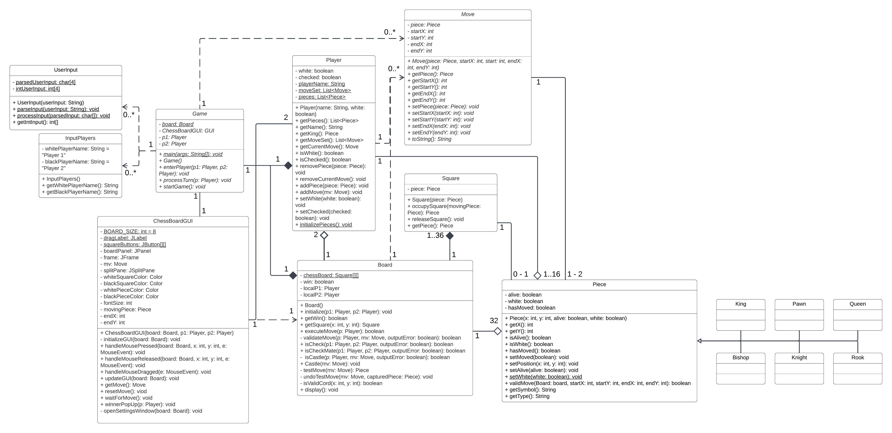

# GUI Chess Game Project

## Team Information
- **Team Name**: Team - 4
- **Team Members**: 
  - Ethan West
  - Miles Belknap
- **Semester**: Fall 2024
- **Course Number and Section**: CS3354 - Section 006

---

## Project Overview
This project is a GUI-based Chess game developed as part of TXST 
Object-Oriented Programming course. It combines backend logic with a graphical interface built over the course of three phases, creating a complete chess game experience with full gameplay functionality.

---

## Preview
### GUI Preview


### Class Diagram


---

## How to Run the Project
Follow these instructions to compile and run the project:

1. **Clone the Repository**:  
   ```bash
   git clone https://git.txstate.edu/ehe12/Team-4.git
   cd Team-4
   ```

2. **Compile the Code**:  
   ```bash
   cd src
   javac -d bin $(find src -name "*.java")
   ```

3. **Run the Game**:  
   ```bash
   java -cp bin game.Game
   ```

---

## Features Checklist
- [x] GUI with an 8x8 Chessboard
- [x] Piece Movement with Mouse Interaction
- [x] Move Validation Based on Chess Rules
- [x] Capture Mechanism
- [x] Check and Checkmate Detection
- [x] Turn-Based Play for Two Players
- [x] Game End Notification on Checkmate
- [x] Settings to Change GUI Appearance
- [ ] Menu Bar with Game Control (New/Save/Load)
- [ ] Game History and Undo Controls
- [ ] AI Opponent with Levels of Skill


---

## Additional Information
For details on Phases 1 and 2, please refer to the branches designated for those implementations. Detailed documentation for those phases is not included in this README.

---

## Acknowledgements
Special thanks to Dr.Xiaomin Li and our team members for their support and collaboration.
